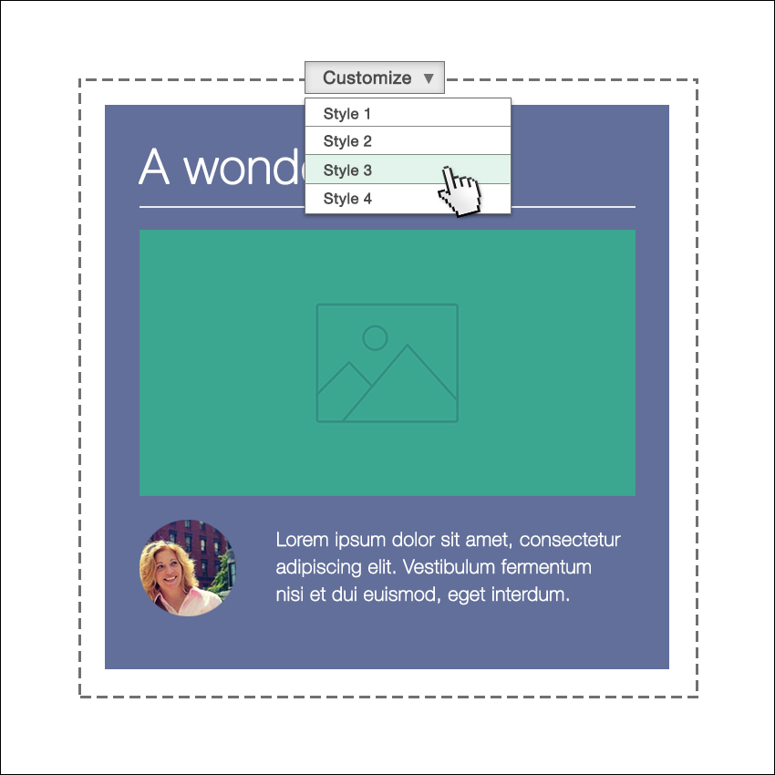
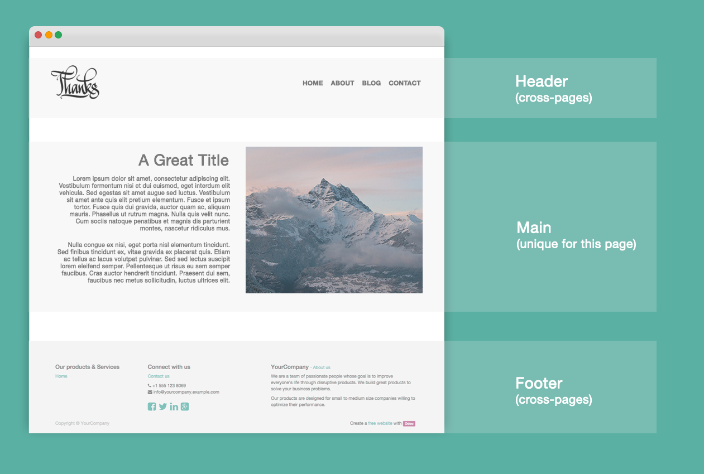
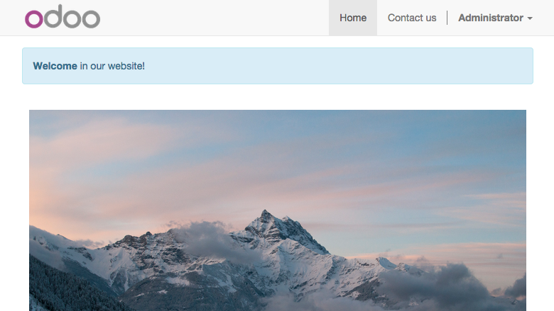
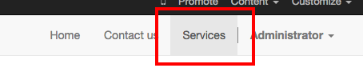
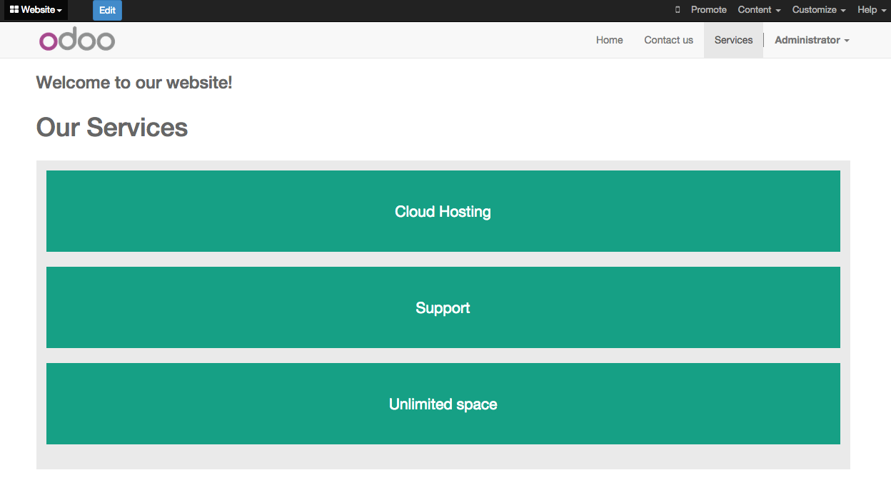
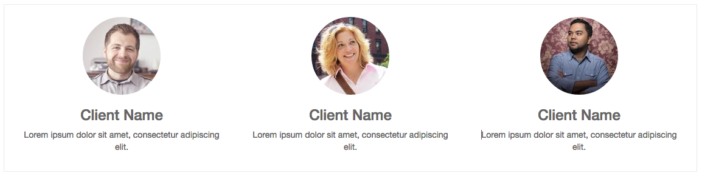
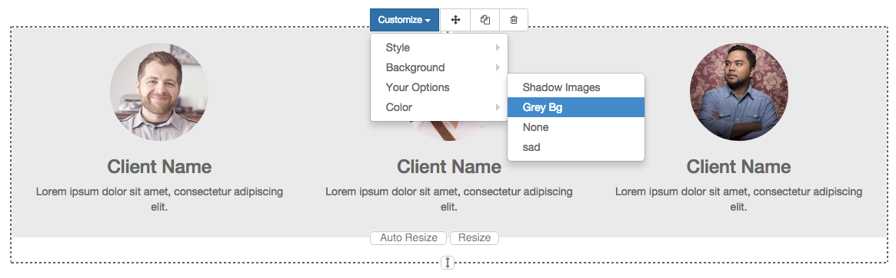
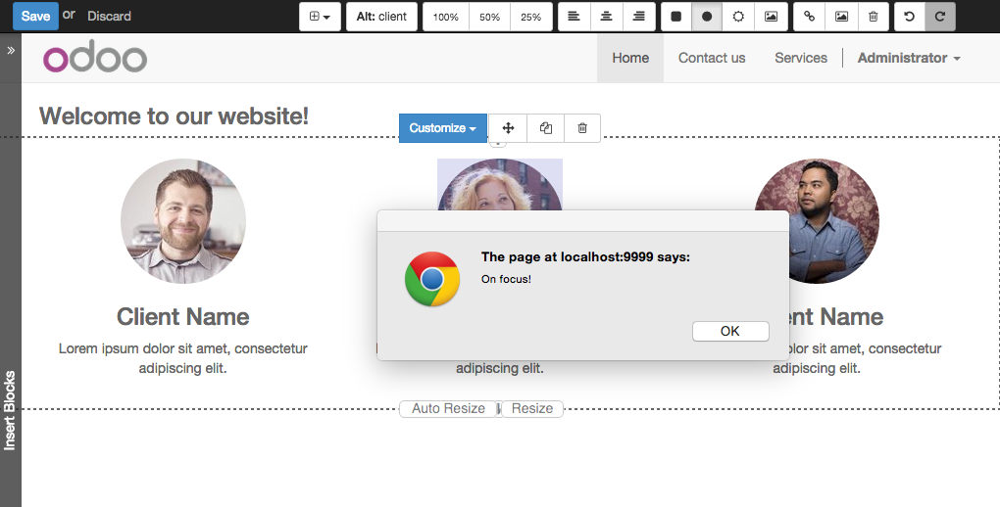

:banner: banners/build_a_theme.jpg

=========================
Tutorial para crear temas
=========================

.. rst-class:: lead

Odoo nos trae la libertad. Libertad para que el diseñador llegue mas allá y libertad para que el usuario pueda personalizar todo a su gusto.

¿Listo para crear sus propios temas? Perfecto. Aquí encontrara varios conceptos que deberá conocer antes de empezar. Este tutorial es una guia para crear temas en Odoo.

.. image:: theme_tutorial_assets/img/Intro.jpg


Introducción para los diseñadores web
=====================================

Si eres un diseñador web que usa Odoo por primera vez, estás en el lugar correcto.
Esta introducción le introducirá en los fundamentos de la creación de temas en Odoo.

.. nota::

   El equipo de Odoo ha creado un potente framework facil de usar. 
   No necesita conocer códigos especiales para utilizar este 
   conjunto de herramientas.

Desde el CMS común a Odoo
-------------------------

.. nota::

   Si siempre ha trabajado y pensado de la misma manera, probablemente 
   haya tenido los mismos resultados. Si buscas algo completamente nuevo, 
   entonces intenta algo diferente.

..

    ¿Dónde está mi archivo header.php?

Esta es la primera pregunta que hace un diseñador web acostumbrado a  trabajar con Wordpress o Joomla y comienza a usar Odoo por primera vez.

.. container:: col-sm-4

   .. image:: theme_tutorial_assets/img/cms.jpg

.. container:: col-sm-7

  Cuando usa los CMS comunes necesita programar varios archivos (como header.php, page.php, post.php, etc.) para crear una estructura básica de su website. Con esos sistemas, esa estructura básica actua como fundamento base y hace que tenga que actualizarse habitualmente para garantizar la compatibilidad con su CMS. Por tanto, después de haber pasado horas programando los archivos, ni siquiera habrá comenzado con el diseño.

  Esto **NO** sucede creando temas en Odoo..


.. nota::
   :class: col-sm-12

   Creemos que el diseño de temas tiene que ser simple (y potente). 
   Cuando creamos nuestro Website Builder, decidimos empezar desde cero 
   en lugar de confiar en lo que ya existía. Este enfoque nos dió la libertad 
   de focalizarnos en las cosas que eran realmente importante para los 
   diseñadores: estilos, contenido y la lógica detrás de ellos. 
   No más luchas con materias técnicas.

La estructura de un tema por defecto en Odoo
--------------------------------------------

.. container:: col-sm-8

  Odoo contiene una estuctura de tema por defecto.
  Es un “tema” muy básico que contiene una mínima estructura y diseño. Cuando usted crea un nuevo tema, está extendiendo esa estructura.
  Indeed it’s always enabled in your setup and it acts exactly like the CMS’s base structure we mentioned above, except that you don’t have to create or maintain it.
  It will upgrade automatically within your Odoo installation and, since it is included in the Website Builder module, everything is smoothly integrated by default.

  Como resultado, usted es libre de focalizarse en el diseño mientras esta estructura hace el trabajo de proporcionar la integración y funcionalidad.

.. container:: col-sm-4

   .. image:: theme_tutorial_assets/img/def_structure.jpg

.. container:: col-md-6

   **Características principaless:**

   * Diseño básico para páginas, blog y eCommerce
   * Integración de Website Builder
   * Snippets básicos
   * Compilación automática Less/Sass
   * Compresión y combinación automática de Js y CSS

.. container:: col-md-6

   **Principales tecnologías:**

   * Twitter Bootstrap
   * jQuery
   * jQuery UI
   * underscore.js

Pensando en "modular"
=====================

Un tema de Odoo no es una carpeta que contiene archivos HTML o PHP, es un framework modular escrito en XML. ¿Nunca has trabajado con archivos XML? No se preocupe, despues de seguir este tutorial, será capaz de crear su primer tema con un conocimiento básico de HTML.

Usando los clásicos flujos de trabajo del diseño web, normalmente programará el diseño de toda la página. El resultado será una página “estatica”. Puede actualizar el contenido, por supuesto, pero su cliente le necesitará cada vez  que tenga que hacer hasta los cambios mas básicos.

Crear temas con Odoo es un cambio total de perspectiva. En lugar de definir el diseño completo de toda la página, usted puede crear bloques (snippets) y dejar al usuario elegir donde arrastrarlos “drag&drop”, creando su propio diseño de página.
Lo llamamos diseño modular.

Imagine un tema Odoo como una “lista” de elementos y opciones of elements and options que usted puede crear y darle estilos.
Como diseñador, su meta es dar estilo a esos elementos con el fin de lograr resultados maravillosos, independientemente de donde el usuario decida colocarlos.

Hagamos un recorrido por nuesta “lista” de elementos:

.. row


   Snippets (constructor de bloques)

   Una porción de código HTML.  El usuario puede arrastrarlo y soltarlo, modificarlo y combinarlo usando nuestra interface Website Builder incorporada. Podrá definir variedad de opciones y estilos para cada snippet. El usuario elegirá el que decida más adecuado para sus necesidades.

.. figure:: theme_tutorial_assets/img/page.jpg
   :figclass: col-sm-6

   Pages (páginas)

   Son páginas webs normales, excepto por que pueden ser editadas por el usuario final y podrá definir un area vacia que el usuario puede “rellenar” arranstrando snippets dentro de ella.

.. /row
.. raw:: html

    <div class="clearfix themes"></div>



   Styles (estilos)

   Los estilos son definidos utilizando archivos CSS estandar (o Less/Sass). Puede definir un estilo como **por defecto** o **opcional**. El estilo por defecto estará siempre activo en su tema, el estilo opcional puede ser activado o desactivado por el usuario.

.. figure:: theme_tutorial_assets/img/functionalities.jpg
   :figclass: col-sm-6

   Functionalities (funcionalidades)

   Gracias a la modularidad de Odoo, todo puede ser personalizado aún más. Esto significa que tiene posibilidades infinitas dentro de su creatividad. Añadir funcionalidades es muy facil y proporcionan al usuario final opciones personalizables de forma sencilla.

.. /row

Odoo's XML files, an overview
-----------------------------

Cualquier archivo XML en Odoo comienza con las especificaciones de "encoding".
Después de esto, puede comenzar a escribir su código dentro de las etiquetas ``<data>`` , que se encuentra entre las etiquetas ``</odoo>``.

.. code-block:: xml

   [XML]
   <?xml version="1.0" encoding="utf-8" ?>
   <odoo>
     <data>
       ## AQUÍ SU CÓDIGO
     </data>
   </odoo>

Casi todos los elementos y opciones que usted vaya a crear deberán de colocarse dentro de la etiqueta ``<template>`` , como muestra el siguiente ejemplo.

.. code-block:: xml

    [XML]
    <template id="my_title" name="My title">
      <h1>Esto es un bloque HTML</h1>
      <h2 class="lead">y esto es un subtítulo</h2>
    </template>

.. importante::

   no entienda mal el significado de ``template`` . Una etiqueta template 
   solo define una parte de código html u opciones - pero no necesariamente 
   coincide con una disposición visual de los elementos.

El código anterior define un título, pero no es visualizado en ninguna parte porque *template* no está asociado con ninguna parte en la **estructura por defecto de Odoo**.  Para que pueda hacer eso debe usar **xpath**, **qWeb** o una combinación de ambos.

Continue leyendo el tutorial para aprender como utilizarlo correctamente en su código.

Actualizando su tema
--------------------

.. container:: col-sm-6

  Dado que los archivos XML solo se cargan cuando instala su tema, deberá forzar la recarga del tema cada vez que realice cambios en algun archivo XML.

  Para hacer esto, pulsa en el botón Upgrade (actualizar) en la página del módulo.

  .. image:: theme_tutorial_assets/img/restart.png

.. container:: col-sm-5

  .. image:: theme_tutorial_assets/img/upgrade_module.png


Creando el módulo de un tema
============================

Los temas de Odoo son empaquetados como módulos. Aunque esté haciendo un diseño muy simple de una web para una empresa o cliente, tendrá que empaquetar el tema como un módulo de Odoo.

``main folder``
  Cree una carpeta llamada: ``theme_`` seguido del nombre de su tema.

``__manifest__.py``
  Cree un archivo vacio y guardelo en su carpeta con el nombre ``__manifest__.py``. El archivo contendrá la información de configuración de su tema.

``__init__.py``
  Cree otro archivo vacio llamado ``__init__.py``. Será un archivo de sistema obligatorio. Creelo y déjelo vacio.

carpetas ``views`` y ``static``
  Creelas en la carpeta principal. La carpeta ``views`` contendrá los archivos xml que definirán sus snippets, páginas y opciones. La carpeta ``static`` será donde colocará sus archivos de estilo, imágenes y código js (javascript).

.. importante::

  Use dos guiones bajos al inicio y al final en los nombres de los archivos init y manifest.

El resultado final será algo como esto:

.. image:: theme_tutorial_assets/img/folder.jpg


.. nota::

   En las versiones anteriores a la 10, el archivo __manifest__.py era denominado __openerp__.py
    
Editando ``__manifest__.py``
----------------------------

Abra el archivo ``__manifest__.py`` que había creado, copia y pega el siguiente código:

.. code-block:: python

  {
    'name':'Tutorial theme',
    'description': 'A description for your theme.',
    'version':'1.0',
    'author':'Your name',

    'data': [
    ],
    'category': 'Theme/Creative',
    'depends': ['website'],
  }

Modifique el valor de las cuatro primeras propiedades con los datos que usted desee.
Esos valores serán utilizados para identificar su nuevo tema en el backend de Odoo.

La propiedad ``data`` contendra la lista de archivos xml. Ahora está vacía, pero iremos agregando archivos a medida que los vayamos creando.

``application: True`` es obligatorio.

``category`` define la categoría de su módulo (siempre “Theme”) y, tras el slash, la subcategoría. Puede usar una subcategoría de las que existen en la lista de categorías de aplicaciones Odoo. (https://www.odoo.com/apps/themes)


``depends`` Especifica las dependencias de su módulo que necesita para que funcione correctamente. Para nuestro tutoria theme, solo necesitamos website. Si necesita características de blog o eCommerce, necesitará agregar también esos módulos.

.. code-block:: python

   ...
   'depends': ['website', 'website_blog', 'sale'],
   ...


Instalando su tema
------------------

Para instalar su tema, coloque la carpeta dentro de la carpeta de addons de su instalación Odoo.

A continuación, navegue hacia Settings page, busque su tema y pulse el botón de instalar.

Estructura de una página en Odoo
================================

Una página Odoo es el resultado visual de una combinación de 2 tipos de elementos, **cross-pages** y **unique**.
Por defecto, Odoo le proporciona un **Header** y un **Footer** (cross-pages) y un único elemento principal que contiene el contenido que hará su página única.

.. nota::

  Los elementos Cross-pages son los mismos elementos en todas las páginas. Los elementos únicos son los que están relaccionados solamente con una página específica.



Para revisar el layout por defecto, cree una nueva página usando el
Website Builder.  Pulse en :menuselection:`Contenido --> Nueva página` e
introduzca el nombre de la página. Inspeccione la página usando su navegador.

.. code-block:: html

  <div id=“wrapwrap”>
    <header />
    <main />
    <footer />
  </div>

Extendiendo el Header por defecto
---------------------------------

Por defecto, el header de Odoo contiene header contains un menú de navegación responsive y el logo de la compañía. Puede añadir fácilmente nuevos elementos y estilos al existente.

Para realizar eso, cree un archivo a **layout.xml** en su carpeta **views** y agregue las etiquetas XML por defecto de Odoo.

.. code-block:: xml

   <?xml version="1.0" encoding="utf-8" ?>
   <odoo>
     <data>

     </data>
   </odoo>

Cree un nuevo template dentro de la etiqueta ``<data>`` , copiando y pegando el siguiente
código.

.. code-block:: xml

  <!-- Customize header  -->
  <template id="custom_header" inherit_id="website.layout" name="Custom Header">

    <!-- Assign an id  -->
    <xpath expr="//div[@id='wrapwrap']/header" position="attributes">
      <attribute name="id">my_header</attribute>
    </xpath>

    <!-- Add an element after the top menu  -->
    <xpath expr="//div[@id='wrapwrap']/header/div" position="after">
      <div class="container">
        <div class="alert alert-info mt16" role="alert">
          <strong>Welcome</strong> in our website!
        </div>
      </div>
    </xpath>
  </template>

El primer xpath agregará el id ``my_header`` al header. Es la mejor opción si quiere añadir
reglas css a ese elemento sin que afecte al contenido del resto de la página.

.. Atención::

  Tenga cuidado al sustituir los atributos de los elementos por defecto. 
  tema vaya extendiendo el tema por defecto, sus cambios tendrán prioridad en futuras actualizaciones de Odoo

El segundo xpath añade un mensaje de bienvenida justo tras el menú de navegaciónwill add a welcome message just after the navigation menu.

El último paso es añadir el layout.xml a la lista de archivos xml utilizados
por el tema. Para hacer eso, edite su archivo ``__manifest__.py`` de esta manera

.. code-block:: python

  'data': [ 'views/layout.xml' ],

Actualice su tema


¡Genial! Ha añadido una id al header y un elemento despues del menú
de navegación. Estos cambios se aplicarán a todas las páginas
de su web.



Creando un diseño de página específico
======================================

Imagine que quiere crear un diseño específico a la página Services.
Para esta página, añadirá una lista de servicios en la parte de arriba y dar al cliente la posibilidad de configurar el resto del diseño de la página usando snippets.

Dentro de su carpeta *views* , cree un archivo **pages.xml** y las etiquetas
por defecto de Odoo.  Dentro de ``<data>`` cree una etiqueta ``<template>`` , establezcaset
el atributo ``page`` en ``True`` y agregue su código dentro.

.. code-block:: xml

   <?xml version="1.0" encoding="utf-8" ?>
   <odoo>
     <data>
       <!-- === Services Page === -->
       <template name="Services page" id="website.services" page="True">
         <h1>Our Services</h1>
           <ul class="services">
             <li>Cloud Hosting</li>
             <li>Support</li>
             <li>Unlimited space</li>
           </ul>
         </template>
       </data>
     </odoo>

El título de la página será el ID del template. En este caso *Services* (desde ``website.services``)

Ha creado con éxito un nuevo layout de página, pero no le ha dicho al sistema **como debe usarlo**.
Para hacer esto, podrá usar **QWeb**. Inserta el código html en una etiqueta ``<t>``,
como en el siguiente ejemplo.

.. code-block:: xml

   <!-- === Services Page === -->
   <template name="Services page" id="website.services" page="True">
     <t t-call="website.layout">
       <div id="wrap">
         <div class="container">
           <h1>Our Services</h1>
           <ul class="services">
             <li>Cloud Hosting</li>
             <li>Support</li>
             <li>Unlimited space</li>
           </ul>
         </div>
       </div>
     </t>
   </template>

Usando ``<t t-call="website.layout">`` ha extendido el layout
de la página por defecto de Odoo con su própio código.

Como puede ver, se ha insertado el código entre dos ``<div>``,  uno con el ID ``wrap`` y el otro con la clase ``container``. Así se proporciona ellayout mínimo.

El siguiente paso es agregar un área vacia donde el usuario pueda
lenar con los snippets. Para hacer esto, cree un ``div`` con la 
clase ``oe_structure`` justo antes de cerrar el elemento ``div#wrap``.

.. code-block:: xml

   <?xml version="1.0" encoding="utf-8" ?>
   <odoo>
   <data>

   <!-- === Services Page === -->
   <template name="Services page" id="website.services" page="True">
     <t t-call="website.layout">
      <div id="wrap">
        <div class="container">
          <h1>Our Services</h1>
          <ul class="services">
            <li>Cloud Hosting</li>
            <li>Support</li>
            <li>Unlimited space</li>
          </ul>
          <!-- === Snippets' area === -->
          <div class="oe_structure" />
        </div>
      </div>
     </t>
   </template>

   </data>
   </odoo>

.. tip::

   You can create as many snippet areas as you like and place them anywhere in your pages.

Su página ya esta lista. Ahora solo hay que añadir  **pages.xml** en su archivo **__manifest__.py**

.. code-block:: python

   'data': [
     'views/layout.xml',
     'views/pages.xml'
   ],

Actualice su tema.


Genial, su página Services está lista y puede acceder a ella navegando a ``/yourwebsite/page/services``.

Observará que es posible arrastrar y soltar debajo de la lista *Our Services*.


Regrese a su archivo *pages.xml* y, después de su template,
copie y pegueel siguiente código.

.. code-block:: xml

  <record id="services_page_link" model="website.menu">
    <field name="name">Services</field>
    <field name="url">/page/services</field>
    <field name="parent_id" ref="website.main_menu" />
    <field name="sequence" type="int">99</field>
  </record>

Este código añadira un link al menú principal.



El atributo **sequence** define la posición del link en el menú superior.
En el ejemplo, le asignamos el valor ``99`` para situarlo el último. Si quiere situarlo en otra posición, tiene que sustituir ese valor de acuerdo a sus necesidades.

Como puede ver si inspecciona el archivo *data.xml* en el módulo ``website`` , El link **Home** tiene un valor de ``10`` y **Contact** tiene un valor de ``60`` por defecto.
Si, por ejemplo, quiere situar su link en el **medio**, tiene que asignar un valor a su link de ``40``.

Añadiendo estilos
=================

Odoo incluye Bootstrap por defecto. Esto significa que puede aprovechar todos los estilos Bootstrap y funcionalidades de dieño.

Por supuesto Boostrap no es suficiente para lograr un diseño único. En los siguientes pasos le mostraremos como puede agregar estilos personalizados a su tema.
El resultado final no sera bonito, pero, pero le proporcionará la información suficiente para que pueda realizar los suyos propios.

Comencemos creando un archivo llamado **style.less** y situado en una carpeta llamada **less** dentro de la carpeta static.
El siguiente código dará estilo a su página *Services* . Copie y pegue y guarde el archivo.

.. code-block:: css

   .services {
       background: #EAEAEA;
       padding: 1em;
       margin: 2em 0 3em;
       li {
           display: block;
           position: relative;
           background-color: #16a085;
           color: #FFF;
           padding: 2em;
           text-align: center;
           margin-bottom: 1em;
           font-size: 1.5em;
       }
   }

El archivo ya está listo pero aún no se ha incluido en nuestro tema.

Vayamos a la carpeta view y crearemos un archivo XML llamado *assets.xml*. Añadiremos las etiquetas xml por defecto de Odoo y copie y pegue el siguiente código. Recuerde cambiar ``theme folder`` por el nombre de la carpeta de su tema.

.. code-block:: xml

   <template id="mystyle" name="My style" inherit_id="website.assets_frontend">
       <xpath expr="link[last()]" position="after">
           <link href="/theme folder/static/less/style.less" rel="stylesheet" type="text/less"/>
       </xpath>
   </template>

Tenemos que crear un template indicando nuestro archivo less. Como puede ver,
nuestro template tiene un atributo especial llamado ``inherit_id``.  Este
atributo le dice a Odoo que nuestro tema está referido por otro para poder
funcionar correctamente.

En este caso, we are referring to ``assets_frontend`` template,
located in the ``website`` module. ``assets_frontend`` specifies the
list of assets loaded by the website builder and our goal is to add
our less file to this list.

This can be achieved using xpath with the attributes
``expr="link[last()]"`` and ``position="after"``, which means "*take my
style file and place it after the last link in the list of the
assets*".

Placing it after the last one, we ensure that our file will
be loaded at the end and take priority.

Finalmente añada **assets.xml** en su archivo **__manifest__.py** .

Actualice su tema.


El archivo less ahora se ha incluído en el tema, y será compilado automaticamente, comprimido y combinado con todos los assets de Odoo.



Crear Snippets
==============

Since snippets are how users design and layout pages, they are the most important element of your design.
Let’s create a snippet for our Service page. The snippet will display three testimonials and it will be editable by the end user using the Website Builder UI.
Navigate to the view folder and create an XML file called **snippets.xml**.
Add the default Odoo xml markup and copy/paste the following code.
The template contains the HTML markup that will be displayed by the snippet.

.. code-block:: xml

   <template id="snippet_testimonial" name="Testimonial snippet">
     <section class="snippet_testimonial">
       <div class="container text-center">
         <div class="row">
           <div class="col-md-4">
             
             <h3>Client Name</h3>
             <p>Lorem ipsum dolor sit amet, consectetur adipiscing elit.</p>
           </div>
           <div class="col-md-4">
             
             <h3>Client Name</h3>
             <p>Lorem ipsum dolor sit amet, consectetur adipiscing elit.</p>
           </div>
           <div class="col-md-4">
             
             <h3>Client Name</h3>
             <p>Lorem ipsum dolor sit amet, consectetur adipiscing elit.</p>
           </div>
         </div>
       </div>
     </section>
   </template>

As you can see, we used Bootstrap default classes for our three columns. It’s not just about layout, these classes **will be triggered by the Website Builder to make them resizable by the user**.

The previous code will create the snippet’s content, but we still need to place it into the editor bar, so the user will be able to drag&drop it into the page. Copy/paste this template in your **snippets.xml** file.

.. code-block:: xml

   <template id="place_into_bar" inherit_id="website.snippets" name="Place into bar">
     <xpath expr="//div[@id='snippet_content']/div[@class='o_panel_body']" position="inside">
       <t t-snippet="theme_tutorial.snippet_testimonial"
          t-thumbnail="/theme_tutorial/static/src/img/ui/snippet_thumb.jpg"/>
     </xpath>
   </template>

.. rst-class:: col-sm-6

Using xpath, we are targeting a particular element with id
``snippet_structure``. This means that the snippet will appear in the
Structure tab. If you want to change the destination tab, you have just to replace the ``id`` value in the xpath expression.


.. image:: theme_tutorial_assets/img/snippet_bar.png
   :class: col-sm-6 shadow-0


============  ==================================
Tab Name      Xpath expression
============  ==================================
Structure     ``//div[@id='snippet_structure']``
Content       ``//div[@id='snippet_content']``
Feature       ``//div[@id='snippet_feature']``
Effect        ``//div[@id='snippet_effect']``
============  ==================================

The ``<t>`` tag will call our snippet's template and will assign a thumbnail placed in the img folder.
You can now drag your snippet from the snippet bar, drop it in your page and see the result.




Opciones de Snippet
===================

Options allow publishers to edit a snippet’s appearance using the Website Builder’s UI.
Using Website Builder functionalities, you can create snippet options easily and automatically add them to the UI.

Opciones de grupos de propiedades
---------------------------------

Las opciones están contenidas en grupos. Los grupos pueden tener propiedades que definen como interactuan las opciones incluídas con el interface de usuario.

``data-selector=" css selector(s) "``
  Vincula todas las opciones del grupo a un elemento particular.
``data-js=" custom method name "``
  Se usa para enlazar métodos Javascript personalizados.
``data-drop-in=" css selector(s) "``
  Define una lista de elementos donde se puede soltar el snippet dentro.
``data-drop-near=" css selector(s) "``
  Define una lista de elementos donde el snippet puede ser soltado a su lado.

Default option methods
----------------------

Options apply standard CSS classes to the snippet. Depending on the method that you choose, the UI will behave differently.

``data-select_class=" class name "``
  More data-select_class in the same group defines a list of classes that the user can choose to apply. Only one option can be enabled at a time.

``data-toggle_class=" class name "``
  The data-toggle_class is used to apply one or more CSS classes from the list to a snippet. Multiple selections can be applied at once.

Let's demonstrate how default options work with a basic example.

We start by adding a new file in our views folder - name it **options.xml** and add the default Odoo XML markup. Create a new template copy/pasting the following


.. code-block:: xml

  <template id="snippet_testimonial_opt" name="Snippet Testimonial Options" inherit_id="website.snippet_options">
    <xpath expr="//div[@data-js='background']" position="after">
      <div data-selector=".snippet_testimonial"> <!-- Options group -->
        <li class="dropdown-submenu">
          <a href="#">Your Option</a>
          <ul class="dropdown-menu"> <!-- Options list -->
            <li data-select_class="opt_shadow"><a>Shadow Images</a></li>
            <li data-select_class="opt_grey_bg"><a>Grey Bg</a></li>
            <li data-select_class=""><a>None</a></li>
          </ul>
        </li>
      </div>
    </xpath>
   </template>

.. note::

  The previous template will inherit the default **snippet_options template** adding our options after the **background** options (xpath expr attribute).
  To place your options in a particular order, inspect the **snippet_options template** from the **website module** and add your options before/after the desired position.

As you can see, we wrapped all our options inside a DIV tag that will
group our options and that will target them to the right selector
(``data-selector=".snippet_testimonial"``).

To define our options we applied ``data-select_class`` attributes to the
``li`` elements. When the user selects an option, the class contained in
the attribute will automatically be applied to the element.

Since ``select_class`` method avoids multiple selections, the last "empty"
option will reset the snippet to default.

Add **options.xml** to ``__manifest__.py`` and update your theme.


Dropping our snippet onto the page, you will notice that our new options are automatically added to the customize menu. Inspecting the page, you will also notice that the class will be applied to the element when selecting an option.

.. image:: theme_tutorial_assets/img/snippet_options.png

Let’s create some css rules in order to provide a visual feedback for our options. Open our **style.less** file and add the following

.. code-block:: css

   .snippet_testimonial {
     border: 1px solid #EAEAEA;
     padding: 20px;
   }

   // These lines will add a default style for our snippet. Now let's create our custom rules for the options.

   .snippet_testimonial {
     border: 1px solid #EAEAEA;
     padding: 20px;

     &.opt_shadow img {
       box-shadow: 0 2px 5px rgba(51, 51, 51, 0.4);
     }

     &.opt_grey_bg {
       border: none;
       background-color: #EAEAEA;
     }
   }



Great! We successfully created options for our snippet.

Any time the publisher clicks on an option, the system will add the class specified in the data-select_class attribute.

By replacing ``data-select_class`` with ``data-toggle_class`` you will be able to select
more classes at the same time.


Opciones Javascript
-------------------

``data-select_class`` y ``data-toggle_class`` are great if you need to perform
simple class change operations. But what if your snippet’s customization needs something more?

Como hemos dicho antes, la propiedad ``data-js`` can be assigned to an options group in order to define a custom method. Let’s create one for our *testimonials snippet* by adding a ``data-js`` attribute to the option’s group div that we created earlier.

.. code-block:: xml

   <div data-js="snippet_testimonial_options" data-selector=".snippet_testimonial">
     [...]
   </div>

Bien. por ahora, el Website Builder buscara el método
``snippet_testimonial_options`` cada vez que el editor entre en
el modo de edición.

Let's go one step further by creating a javascript file, name
it **tutorial_editor.js** and place it into the **static** folder.  Copy/paste
the following code

.. code-block:: javascript

    (function() {
        'use strict';
        var website = odoo.website;
        website.odoo_website = {};
    })();

Great, we successfully created our javascript editor file. This file will contain all the javascript functions used by our snippets in edit mode. Let’s create a new function for our testimonial snippet using the ``snippet_testimonial_options`` method that we created before.

.. code-block:: javascript

   (function() {
       'use strict';
       var website = odoo.website;
       website.odoo_website = {};

       website.snippet.options.snippet_testimonial_options = website.snippet.Option.extend({
           on_focus: function() {
               alert("On focus!");
           }
       })
   })();

As you will notice, we used a method called ``on_focus`` to trigger our function. The Website Builder provides several events you can use to trigger your custom functions.

===========================  ==================================
Event                        Description
===========================  ==================================
``start``                    Fires when the publisher selects the snippet for the first time in an editing session or when the snippet is drag-dropped into the page
``on_focus``                 Fires each time the snippet is selected by the user or when the snippet is drag-dropped into the page.
``on_blur``                  This event occurs when a snippet loses focus.
``on_clone``                 Fires just after a snippet is duplicated. A new js variable is created ($clone) containing the cloned element.
``on_remove``                It occurs just before that the snippet is removed.
``drop_and_build_snippet``   Fires just after that the snippet is drag and dropped into a drop zone. When this event is triggered, the content is already inserted in the page.
``clean_for_save``           It trigger before the publisher save the page.
===========================  ==================================

Let’s add our new javascript files to the editor assets list.
Go back to **assets.xml** and create a new template like the previous one.
This time we have to inherit ``assets_editor`` instead of ``assets_frontend``.

.. code-block:: xml

  <template id="my_js" inherit_id="website.assets_editor" name="My Js">
    <xpath expr="script[last()]" position="after">
      <script type="text/javascript" src="/theme_tutorial/static/src/js/tutorial_editor.js" />
    </xpath>
  </template>

Update your theme


Let’s test our new javascript function. Enter in Edit mode and drop into the page.
You should now see the javascript alert that we bound on the ``on_focus`` event.
If you close it, then click outside of your snippet and then click in it again, the event will trigger again.




Editando la Guia de Referencia
==============================

Basicamente todos los elementos de la página pueden ser editados por el usuario.
Además. algunos tipos de elementos y clases css  activarán funciones especiales del Website Builder cuando se edite.

Layout
------

``<section />``
  Any section element can be edited like a block of content. The publisher can move or duplicate it. It’s also possible to set a background image or color. Section is the standard main container of any snippet.

``.row > .col-md-*``
  Any medium  bootstrap columns  directly descending from a .row element, will be resizable by the publisher.

``contenteditable="False"``
  This attribute will prevent editing to the element and all its children.

``contenteditable="True"``
  Apply it to an element inside a contenteditable="False" element in order to create an exception and make the element and its children editable.

``<a href=”#” />``
  In Edit Mode, any link can be edited and styled. Using the “Link Modal” it’s also possible to replace it with a button.

Media
-----
``<span class=”fa” />``
  Pictogram elements. Editing this element will open the Pictogram library to replace the icon. It’s also possible to transform the elements using CSS.

````
  Once clicked, the Image Library will open and you can replace images. Transformation is also possible for this kind of element.

.. code-block:: html

  <div class="media_iframe_video" data-src="[your url]" >
    <div class="css_editable_mode_display"/>
    <div class="media_iframe_video_size"/>
    <iframe src="[your url]"/>
  </div>

This html structure will create an ``<iframe>`` element editable by the publisher.


Buenas prácticas SEO
====================

Facilitar la inserción de contenido
-----------------------------------

Modern search engine algorithms increasingly focus on content, which means there is less focus on **keyword saturation** and more focus on whether or not the content is **actually relevant to the keywords**.

As content is so important for SEO, you should concentrate on giving publishers the tools to easily insert it. It is important that your snippets are “content-responsive”, meaning that they should fit the publisher’s content regardless of size.

Let’s have a look to this example of a classic two column snippet, implemented in two different ways.


.. container:: col-sm-7

  .. image:: theme_tutorial_assets/img/seo_snippet_wrong.png

.. container:: col-sm-5

  Mal

  Using fixed image, the publisher will be forced to limit the text in order to follow the layout.


.. container:: col-sm-7

  .. image:: theme_tutorial_assets/img/seo_snippet_good.png

.. container:: col-sm-5

  Bien

  Using background images that fit the column height, the publisher will be free to add the content regardless of the image’s height.


Segmentación de Página
----------------------

Basically, page segmentation means that a page is divided into several separate parts and these parts are treated as separate entries by search engines.
When you design pages or snippets, you should be sure to use the right tags in order to facilitate search engine indexing.

``<article>``
  Specifies an independent block of content. Within it should be a piece of self-contained content that should make sense on its own. You can nest ``<article>`` elements within one another. In this case, it’s implied that the nested elements are related to the outer ``<article>`` element.

``<header>``
  Indicates the header section of a self-contained block of content (an ``<article>``).

``<section>``
  Is the snippet default tag and it specifies a subsection of a block of content. It can be used to split ``<article>`` content into several parts. It’s advisable to use a heading element (``<h1>`` – ``<h6>``) to define the section’s topic.

``<hgroup>``
  Is used to wrap a section of headings (``<h1>`` - ``<h6>``). A great example would be an article with both a headline and sub-headline at the top:

  .. code-block:: html

    <hgroup>
      <h1>Main Title</h1>
      <h2>Subheading</h2>
    </hgroup>

Describa su página
------------------

Defina keywords
'''''''''''''''
Debe usar las keywords más relevantes y apropiadas y sus sinónimos. You can define them for each page using the built-in “Promote” function found in the bar at the top.

Defina un título y una descripción
''''''''''''''''''''''''''''''''''

Define them using the “Promote” function. Keep your page titles short and include the main keyword phrase for the page.
Good titles evoke an emotional response, ask a question or promise something.

Descriptions, while not important to search engine rankings, are extremely important in gaining user click-through. These are an opportunity to advertise content and to let people searching know exactly whether the given page contains the information they're looking for. It is important that titles and descriptions on each page are unique.
